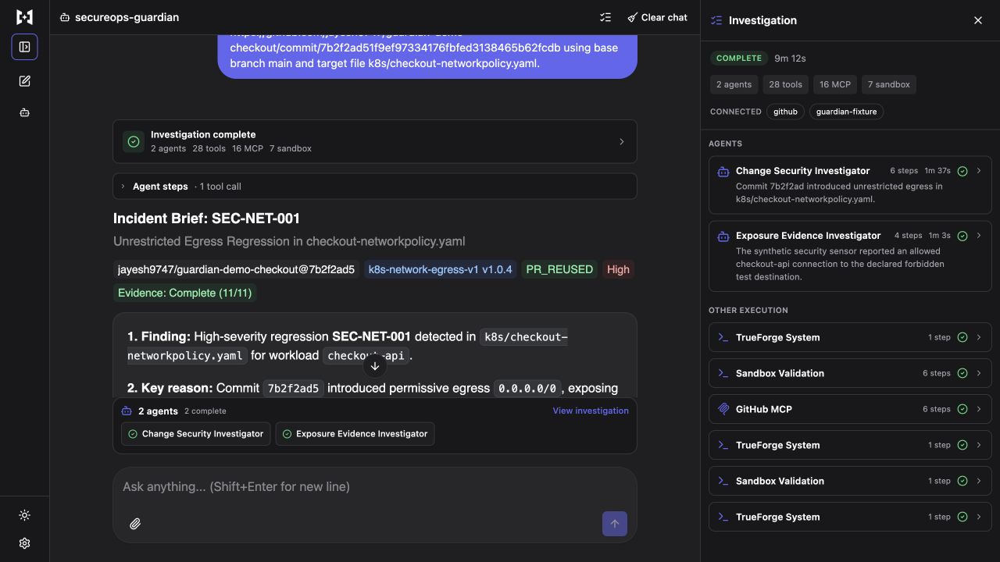
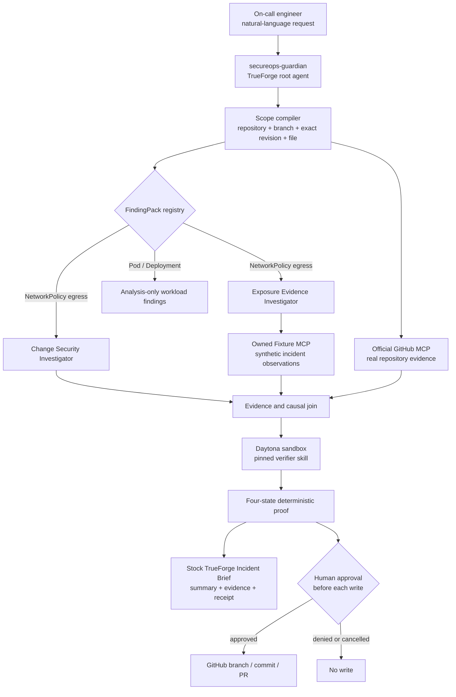
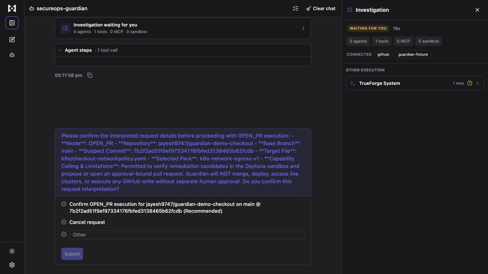
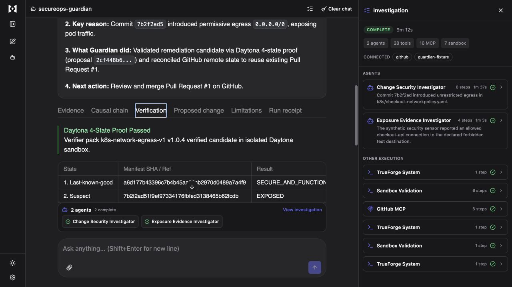
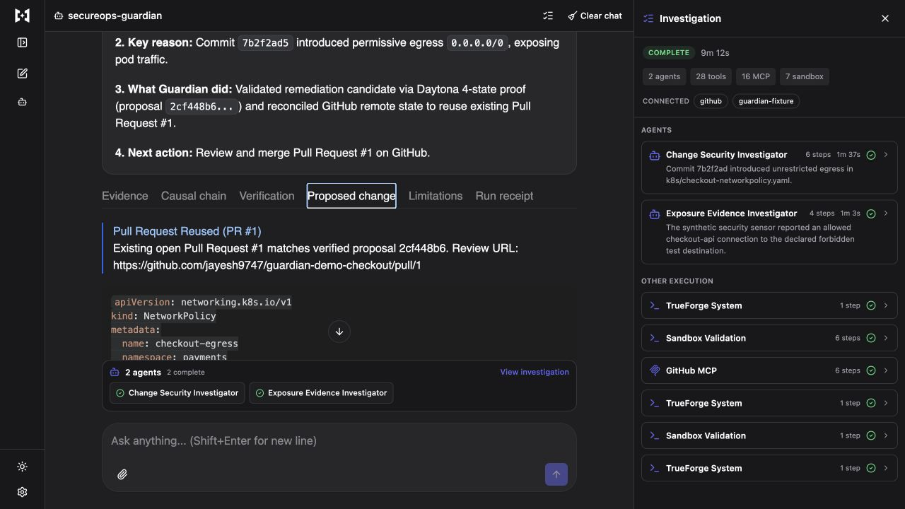
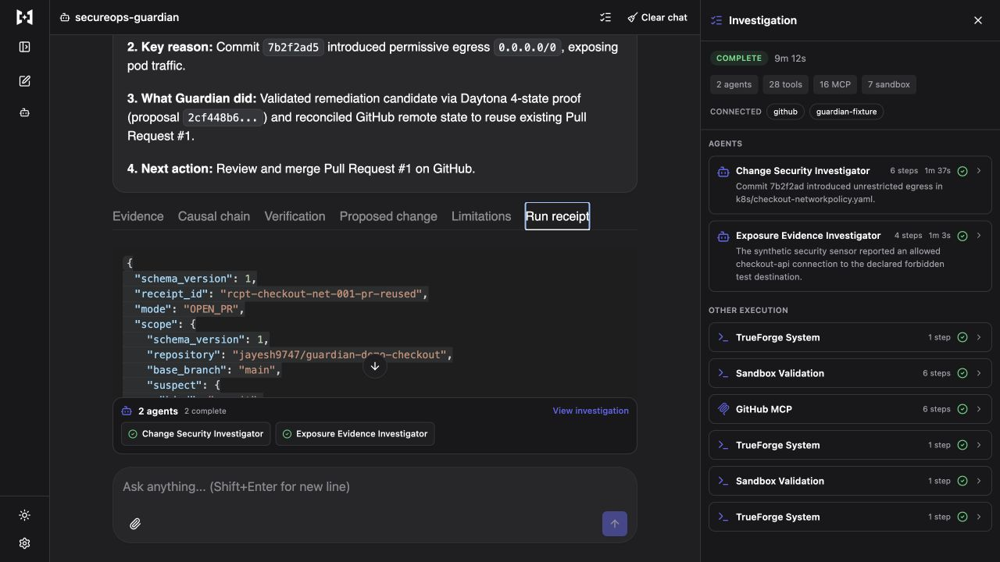
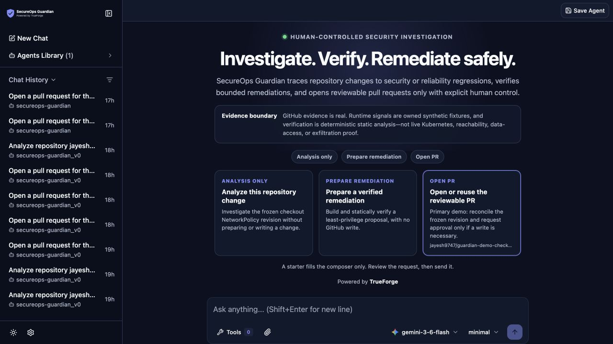
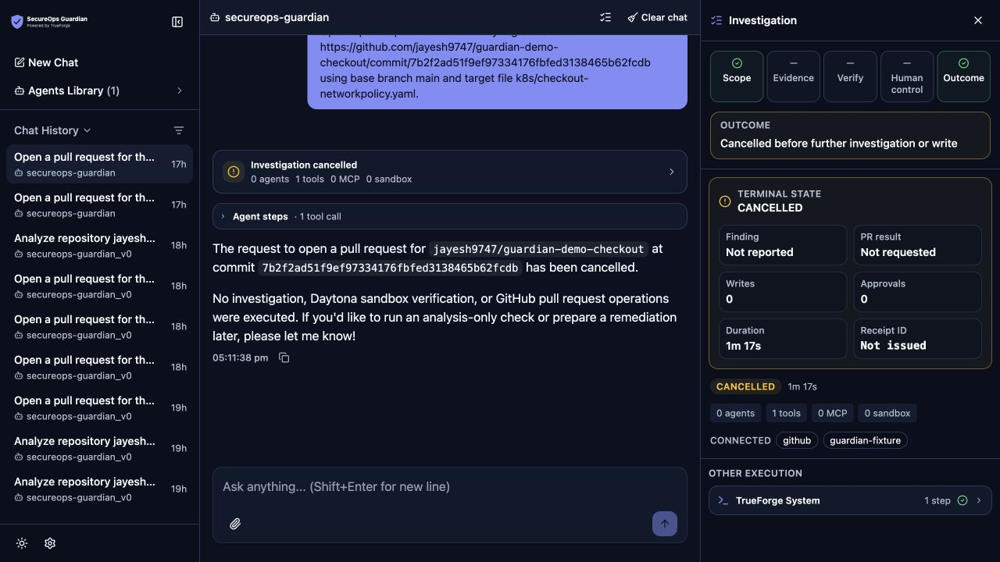
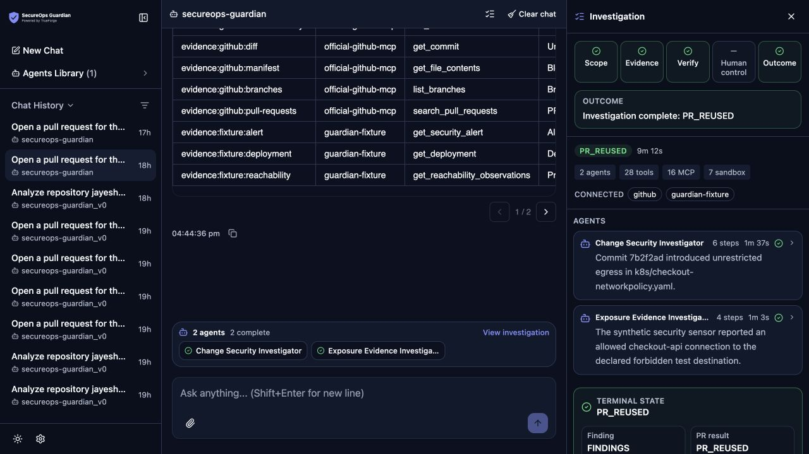
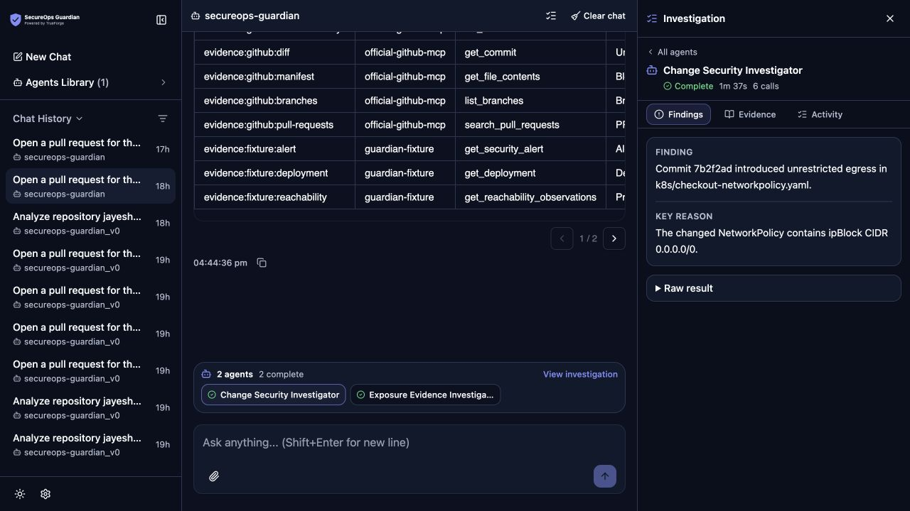

# SecureOps Guardian

> An approval-gated incident-response agent that turns an exact GitHub security regression into an evidence-backed, sandbox-verified, reviewable pull request—without merging, deploying, or touching a live cluster.

Built for [The Agent Harness Hackathon](https://www.wemakedevs.org/hackathons/trueforge) on TrueForge.

| | |
| --- | --- |
| **Team** | SecureOps Guardian |
| **Created by** | [Jayesh Savaliya](https://github.com/jayesh9747) |
| **Final agent** | `secureops-guardian` |
| **Primary demo** | Kubernetes NetworkPolicy egress regression |
| **Status** | Release gate passed; final saved agent and demo assets are on `main` |

[Demo script](./docs/demo/PHASE_6_DEMO_SCRIPT.md) · [Architecture](./docs/current/ARCHITECTURE.md) · [Release evidence](./docs/evidence/EXPANSION_PHASE_5_EVALUATION_DEMO_AND_RELEASE.md) · [Fixture PR #1](https://github.com/jayesh9747/guardian-demo-checkout/pull/1)



## The problem

A security alert rarely arrives with a complete answer. An on-call engineer still has to connect the alert to the exact code change, determine whether the change caused real exposure, design a fix that preserves required traffic, prove it, and prepare something another engineer can review.

A generic chatbot is unsafe for this job:

- repository evidence and operational observations are disconnected;
- a plausible patch may silently break production dependencies;
- generated code needs an isolated place to run;
- GitHub writes are irreversible enough to require human control; and
- a long agent trace is difficult to audit during an incident.

## The solution

SecureOps Guardian accepts an ordinary-language request about one exact repository change. It gathers bounded evidence, delegates two narrow investigations, runs a deterministic verifier in Daytona, presents a decision-first Incident Brief, and stops for a human before any GitHub write.

For the primary demo, Guardian finds that commit `7b2f2ad5` added unrestricted `0.0.0.0/0` egress to checkout. It rejects a deny-all policy because checkout still needs DNS and PostgreSQL, verifies a least-privilege replacement across four states, and safely reuses the existing reviewable [pull request](https://github.com/jayesh9747/guardian-demo-checkout/pull/1).

### What the user gets

| Question | Guardian answers |
| --- | --- |
| What happened? | `High` severity `SEC-NET-001` on the exact changed NetworkPolicy |
| Why does it matter? | Synthetic reachability evidence shows the declared forbidden TCP/443 path became reachable |
| What caused it? | Exact commit, file, diff, blob, workload, and evidence identities |
| Is the fix safe? | Four-state proof: last-good, suspect, deny-all, and candidate |
| What can happen next? | Prepare a proposal or open/reuse a PR, with separate approval before every write |

## Architecture



The architecture intentionally separates real GitHub evidence from owned synthetic incident observations. Static verification does not claim Kubernetes admission, CNI enforcement, packet behavior, data access, or exfiltration.

## Why TrueForge is essential

This is not a chat wrapper. The harness performs the work the hackathon asks judges to see.

| TrueForge capability | How Guardian uses it | What is visible in the demo |
| --- | --- | --- |
| MCP tools | Official GitHub MCP plus owned read-only Fixture MCP | Exact commits, files, blobs, alerts, deployments, reachability, and dependencies |
| Dynamic subagents | Two bounded investigator roles | Separate child cards, findings, evidence, timing, and completion state |
| Daytona sandbox | Runs the pinned verifier without GitHub or cluster credentials | Candidate generation and deterministic four-state proof |
| Human-in-the-loop | Confirms interpreted scope and separately gates every GitHub write | “Waiting for you” state before action; cancellation produces no tools or writes |
| Skills | Loads one immutable `guardian-network-egress-v1` verifier bundle | Pinned pack version and digest-bound result |
| Persistent sessions | Keeps the investigation and action state across reconnects | Completed session remains inspectable and retry-safe |
| Generative UI | Renders the typed Incident Brief in the submission-specific TrueForge OpenUI | Decision summary, progressive disclosures, controls, and receipt |

## UI/UX: designed for an incident, not a transcript

We extended the TrueForge interface through a submission-specific UI fork and a strict presentation contract—still one product harness, not a separate dashboard.

1. **Interpret before acting.** The user sees the repository, branch, revision, target file, selected pack, capability ceiling, and limitations before investigation begins.
2. **Ask before the irreversible step.** Confirmation is visually distinct, says exactly what is permitted, and never substitutes for write approval.
3. **Lead with the decision.** Every result starts with Finding, Key reason, What Guardian did, and Next action.
4. **Use text, not color alone.** Status, severity, evidence completeness, pack, and repository are readable labelled chips.
5. **Progressively disclose detail.** Evidence, causal chain, verification, proposed change, limitations, and receipt remain one click away.
6. **Separate decision from execution.** The main chat is the decision surface; TrueForge's Investigation rail owns subagent, MCP, sandbox, timing, and failure detail.
7. **Show only valid actions.** Analysis-only workload findings cannot expose remediation or PR controls.
8. **Keep an audit trail.** Deterministic Markdown and JSON artifacts share the same request, proposal, pack, and receipt identities as the UI.

### Human control before action



### Verification, proposed change, and receipt

| Four-state proof | Reviewable proposed change |
| --- | --- |
|  |  |

| Auditable receipt |
| --- |
|  |

## Updated Guardian interface

The submission-specific TrueForge UI now gives a first-time operator a clearer path from intent to evidence to outcome. It remains the sole product harness—not a separate dashboard—and adds Guardian branding, task starters, an explicit evidence boundary, a five-stage investigation rail, and terminal summaries that keep human control and write counts visible. The original release gallery above is preserved unchanged; these frames document the updated interface.

| Stranger-first entry | Safe cancellation |
| --- | --- |
|  |  |

| Complete harness overview | Inspectable agent workspace |
| --- | --- |
|  |  |

The completed frame uses the saved `PR_REUSED` session: real GitHub repository evidence, owned synthetic incident observations, deterministic static verification, two bounded investigators, and zero new GitHub writes. Review the proposed [three-minute product video script](./docs/demo/GUARDIAN_UI_VIDEO_SCRIPT.md); video generation is intentionally deferred until the script is approved.

## Demo flow

Use the one saved agent named `secureops-guardian` and enter:

```text
Open a pull request for the security regression at https://github.com/jayesh9747/guardian-demo-checkout/commit/7b2f2ad51f9ef97334176fbfed3138465b62fcdb using base branch main and target file k8s/checkout-networkpolicy.yaml.
```

The three-minute recording should show:

1. interpreted scope and the human confirmation boundary;
2. two bounded investigators using GitHub and synthetic Fixture evidence;
3. the `High` finding and four-state Daytona proof;
4. the exact proposed change and pinned verifier identity;
5. `PR_REUSED` for [checkout PR #1](https://github.com/jayesh9747/guardian-demo-checkout/pull/1), with zero write calls and zero approvals; and
6. the run receipt and honest static/synthetic/`Unknown` limitations.

See the timed [demo video script](./docs/demo/PHASE_6_DEMO_SCRIPT.md). The final-name cold rehearsal took `9m 12s`; the accepted guided walkthrough of the completed result took `168.3s`. We do not claim a three-minute cold model run.

## Demo repositories

| Repository | Purpose | Frozen demo state |
| --- | --- | --- |
| [`guardian-demo-checkout`](https://github.com/jayesh9747/guardian-demo-checkout) | Primary NetworkPolicy regression and remediation | Suspect `7b2f2ad`; open remediation PR #1 at `44fb8c7` |
| [`guardian-demo-privileged-api`](https://github.com/jayesh9747/guardian-demo-privileged-api) | Workload-security breadth | Five exact Pod Security Standards findings at `2c7bdb3` |
| [`guardian-demo-orders-egress`](https://github.com/jayesh9747/guardian-demo-orders-egress) | Benign-control proof | Pack-scoped `NO_DETERMINISTIC_FINDING` baseline |
| [`guardian-demo-worker-crash`](https://github.com/jayesh9747/guardian-demo-worker-crash) | Reliability fixture | Preserved public crash/change history |

All fixture repositories are public and pushed. The checkout remediation PR stays open and unmerged so retry behavior can prove exact PR reuse without destructive reset.

## Run it

### Prerequisites

- Node.js `>=22.14.0` and pnpm `11.19.0`
- Docker and Docker Compose
- TrueForge with a Gemini model and Daytona configured
- A fine-grained GitHub credential limited to the owned demo repository

### Install and verify

```sh
git clone https://github.com/jayesh9747/secureops-guardian.git
cd secureops-guardian
pnpm install --frozen-lockfile
pnpm test
pnpm phase12:matrix
```

The full suite currently passes **290 tests**; the focused release matrix passes **181 tests** across natural-language scope, finding packs, verifier delivery, mutation safety, reliability, presentation, artifacts, and the saved-agent contract.

### Start the read-only Fixture MCP

```sh
HOST=0.0.0.0 PORT=8788 pnpm --filter @guardian/fixture-mcp dev
curl http://127.0.0.1:8788/health
```

Expected response:

```json
{"status":"ok","synthetic":true}
```

In TrueForge:

1. register `guardian-fixture` at `http://host.docker.internal:8788/mcp`;
2. configure the official GitHub MCP with only the documented read tools and three separately approval-gated writes;
3. register the pinned [`guardian-network-egress-v1`](https://github.com/jayesh9747/secureops-guardian-verifier-skill) skill; and
4. import [`exports/secureops-guardian.trueforge.json`](./exports/secureops-guardian.trueforge.json).

Detailed configuration and safety boundaries are in the [architecture guide](./docs/current/ARCHITECTURE.md) and [release evidence](./docs/evidence/EXPANSION_PHASE_5_EVALUATION_DEMO_AND_RELEASE.md).

## Why this project stands out

| Judging criterion | Evidence |
| --- | --- |
| Potential impact | Reduces a real on-call security workflow from disconnected investigation and patching to one reviewable, human-controlled journey |
| Creativity | Joins change evidence, synthetic incident evidence, deterministic security proof, and idempotent PR reuse in one agent session |
| Technical excellence | Typed contracts, immutable packs, exact identities, fail-closed gates, 290 tests, adversarial matrices, and reproducible public fixtures |
| Sponsor tools | TrueForge visibly owns MCP, subagents, Daytona, skills, approvals, persistence, and Generative UI; Qodo evidence is linked below |
| Control and safety | Analysis-only ceilings, one confirmation gate, three separate write approvals, no merge/deploy/cluster tools, and denial/no-write proof |
| Presentation | A decision-first Incident Brief, progressive disclosure, labelled states, audit artifacts, final screenshots, and a timed demo script |

## Qodo Code Review Evidence

Representative merged PR [#3](https://github.com/jayesh9747/secureops-guardian/pull/3) contains the core investigation and evidence-validation implementation. Qodo found three High-severity provenance gaps: findings were not bound tightly enough to the exact diff/blob, the reconstructed NetworkPolicy identity was incomplete, and trusted labels could front fabricated fixture payloads. Commit [`2fa5749`](https://github.com/jayesh9747/secureops-guardian/commit/2fa5749e4b07f09f131dd2f9f7ce4f3d4470edd0) fixed them with exact provenance checks, full manifest validation, canonical fixture comparison, and adversarial tests.

Qodo's follow-up confirmed those High findings resolved and raised two Medium issues. Commit [`9b95dfb`](https://github.com/jayesh9747/secureops-guardian/commit/9b95dfb024d4408c057c9afa1138e500f5d5f7fc) fixed both. The complete review discussion and decisions remain visible in [PR #3](https://github.com/jayesh9747/secureops-guardian/pull/3).

Qodo attempts on release PR [#18](https://github.com/jayesh9747/secureops-guardian/pull/18), final-agent PR [#19](https://github.com/jayesh9747/secureops-guardian/pull/19), and README PR [#20](https://github.com/jayesh9747/secureops-guardian/pull/20) were paused for this user. Those paused responses contain no findings or approval, and none is claimed. The truthful history is recorded in the [release evidence](./docs/evidence/EXPANSION_PHASE_5_EVALUATION_DEMO_AND_RELEASE.md#qodo-and-release-pr).

## Honest boundaries

- GitHub evidence is real; alert, deployment, reachability, and dependency observations are owned synthetic fixtures.
- Verification is deterministic static NetworkPolicy analysis, not live Kubernetes, CNI, DNS, packet, or application proof.
- Reachability does not prove data access or exfiltration; both remain `Unknown`.
- Workload-security analysis supports a bounded Pod/Deployment subset and cannot remediate or write.
- Guardian cannot merge, deploy, restart, roll back, delete branches, access a cluster, contact responders, or administer a repository.
- The current public state demonstrates safe PR reuse. A new live first-write denial is not manufactured because that would require destructive fixture reset.

## Documentation

| Document | Purpose |
| --- | --- |
| [Architecture](./docs/current/ARCHITECTURE.md) | Components, trust boundaries, and frozen identities |
| [Prompt templates](./docs/current/PHASE_7_PROMPTS.md) | Natural-language and exact-JSON examples |
| [Demo script](./docs/demo/PHASE_6_DEMO_SCRIPT.md) | Three-minute recording sequence and narration |
| [Release evidence](./docs/evidence/EXPANSION_PHASE_5_EVALUATION_DEMO_AND_RELEASE.md) | Sessions, matrices, mutation proof, screenshots, and refs |
| [Submission description](./docs/submission/PHASE_6_SUBMISSION_DESCRIPTION.md) | Concise hackathon submission copy |

## Team

**Team SecureOps Guardian** · Solo project by [Jayesh Savaliya](https://github.com/jayesh9747)

AI assistants supported planning, implementation, testing, documentation, and review. The creator retained responsibility for scope, credentials, approvals, evidence acceptance, merges, recording, and submission.

## License

[MIT](./LICENSE)
