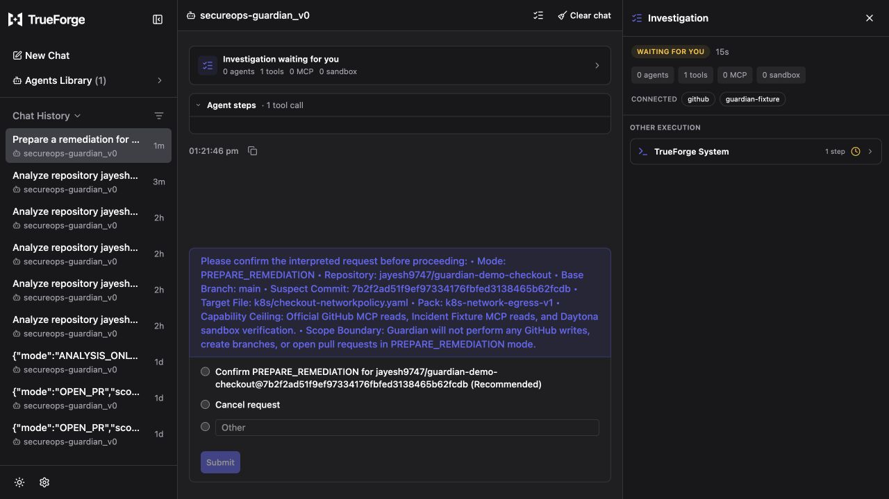
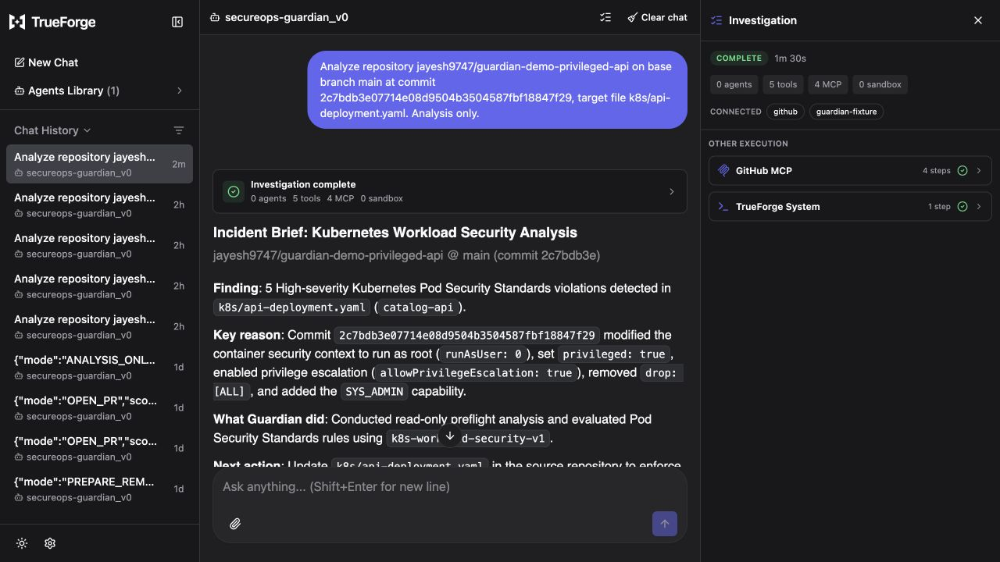
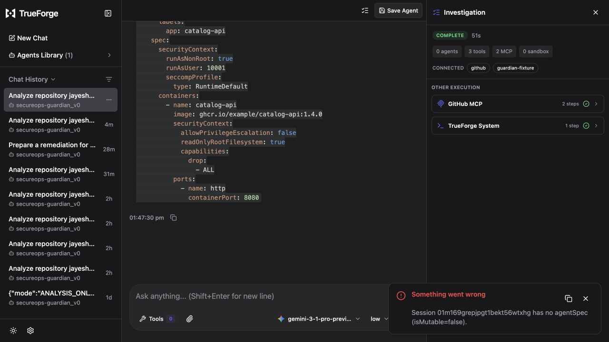
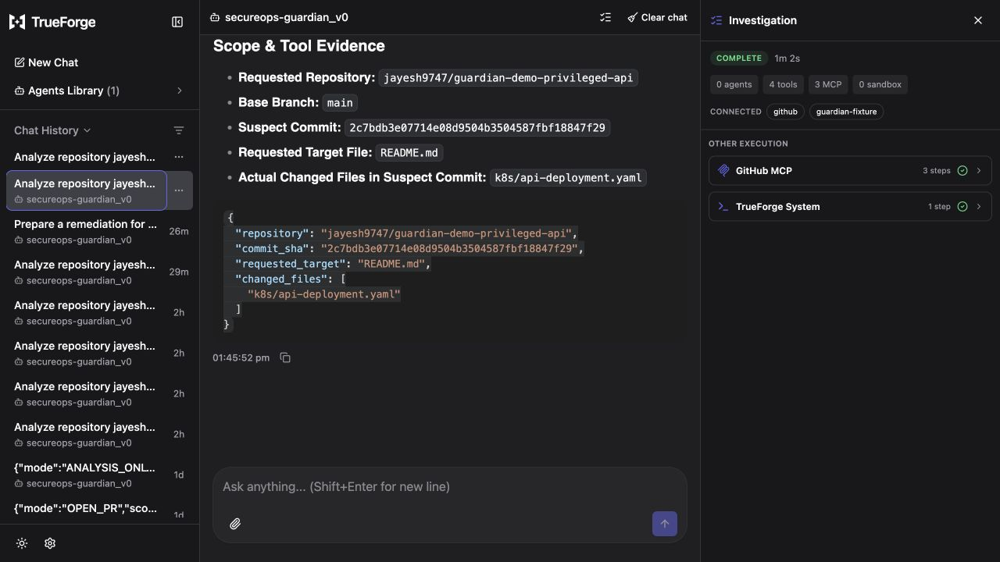
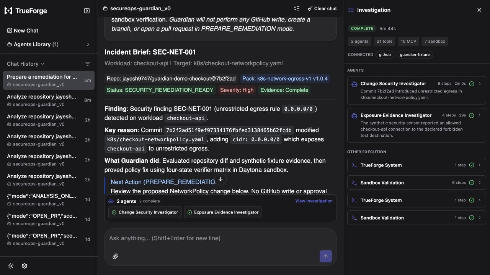
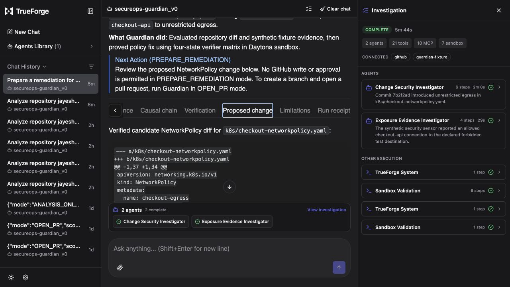
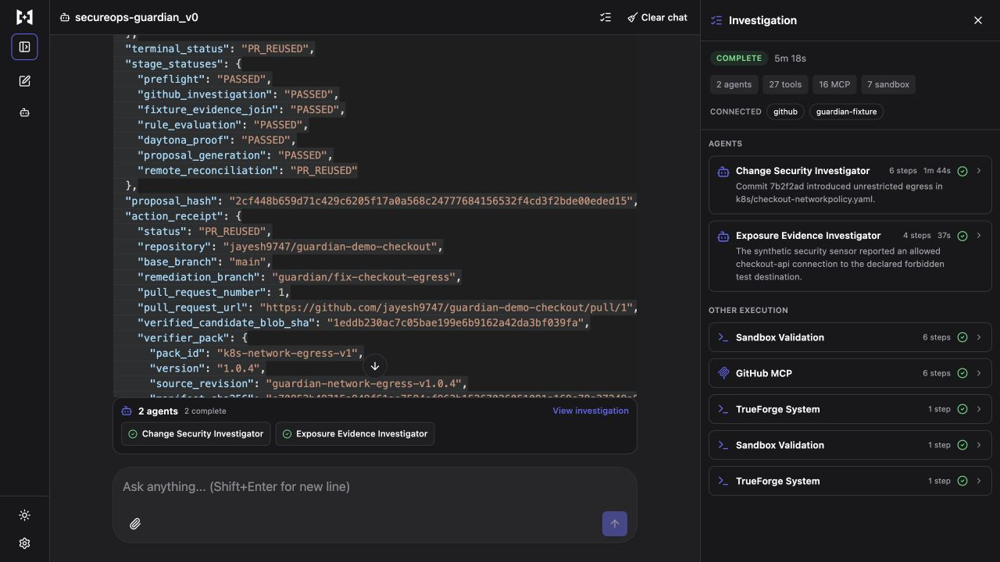

# Expansion Phase 4 — Incident Brief and artifacts evidence

Date: 29 August 2026

Branch: `expansion-phase-4/incident-brief-artifacts`

Base: `origin/main` at `cecf0f42c26061351eb26f808e454def0d8b26fc`

## Implemented boundary

Phase 11 adds presentation and representation contracts without changing finding, verification,
proposal, approval, GitHub-write, or runtime behavior.

- A strict interpreted-request card binds repository, branch, exact commit/comparison, optional
  file, pack, capability ceiling, and the typed compiler digest. Its visible confirmation notice
  states that request confirmation is not GitHub-write approval.
- A strict `GuardianIncidentBrief` answers Finding, Key reason, What Guardian did, and Next action
  in no more than 120 words. Text-labelled tags carry repository/revision, pack, status, severity,
  and evidence completeness; there is no numeric score.
- Tabs are ordered Evidence, Causal chain, conditional Verification, conditional Proposed change,
  Limitations, and Run receipt. Workload ANALYSIS_ONLY has no verification, proposal, approval, PR
  control, or sandbox-export route.
- Deterministic builders generate `guardian-incident-brief.md`,
  `guardian-run-receipt.json`, and conditional `guardian-verified-change.json` from validated typed
  objects. Request/receipt/proposal IDs and hashes, pack, repository, branch, revision, and file must
  agree before generation. Artifact generation recomputes the complete proposal hash and verifier
  pack binding, so altered candidate YAML, diff, target, proof, or pack content fails closed.
- The typed Investigation rail projection validates one row per child, elapsed time, a
  one-sentence result, and tool ownership. Journey and workload routing accept observed rail input
  and return its validated projection, including elapsed time for running children; they return no
  projection when the caller has no rail evidence instead of inventing rows or timings. Execution
  detail is not copied into the Incident Brief.
- Normal prose uses normal stock UI type. Monospace is limited to identifiers, hashes, paths, YAML,
  diffs, and receipts. Tags include text, so status does not depend on color. No unhandled button is
  emitted; a real PR may expose only a review link.

File download remains optional. Typed copyable representations are the portable contract. The
stock harness may expose files already produced in a remediation sandbox, but the analysis-only
route never creates or enters a sandbox for export.

## Deterministic verification

`pnpm phase11:matrix` covers:

1. remediation ready;
2. denied;
3. PR created;
4. PR reused;
5. missing-deployment inconclusive;
6. missing-reachability inconclusive;
7. conflicting-revision inconclusive;
8. write conflict; and
9. no safe remediation.

Every entry records the terminal status, request ID, receipt ID, conditional proposal ID, summary
word count, disclosure tabs, and SHA-256 digests of its OpenUI, Markdown, receipt JSON, and optional
verified-change JSON. Summary counts are 34–43 words. The three inconclusive entries omit
Verification and Proposed change; no-safe-remediation retains Verification but omits Proposed
change. All identity-mismatch tests fail closed, including exact revision drift and a forged
candidate that retains the old proposal identifiers. Workload tests cover both `FINDINGS` and
`NO_DETERMINISTIC_FINDING`; routing tests cover exact-target and capability-stop `INCONCLUSIVE`
results with complete four-field fallbacks.

The complete local gate passed:

```text
pnpm format:check
pnpm lint
pnpm typecheck
pnpm test              # 27 files, 290 tests
pnpm build
pnpm bundle:verifier
pnpm phase5:matrix
pnpm phase6:matrix
pnpm phase7:matrix
pnpm phase10:matrix
pnpm phase11:matrix
git diff --check
```

## Stock TrueForge evidence

The portable manifest and saved `secureops-guardian_v0` manifest were read back and canonicalized to
the same SHA-256:

`daa2314a9af6bee629edeb831e0458924d4136f8e8710d062d16ca181df3fcff`

Fresh sessions were used after reconciliation; existing sessions and fixture PR #1 were not edited.

### Interpreted remediation request

Session `01m1681mp3e3g36xv6dgsk08gb` stopped before investigation and displayed the exact repository,
branch, suspect commit, target file, selected pack, capability ceiling, and no-write boundary. The
rail showed `Waiting for you`, one TrueForge system step, zero MCP calls, and zero sandboxes.



### Workload analysis-only result

Session `01m167w7b47y6c2d8yhk4n364g` rendered the four decision fields, labelled pack/status/severity/
evidence tags, Evidence/Causal chain/Limitations/Run receipt tabs, and no remediation control. The
rail recorded four GitHub MCP steps and zero sandboxes. This live rendering is UX evidence; the
TypeScript builders and cross-representation tests, not a prompt-authored live receipt string, are
the deterministic identity authority.



### Workload no-finding result

Session `01m169grepjpgt1bekt56wtxhg` analyzed the benign workload fixture and displayed a deliberate
clean/no-deterministic-finding result with all four decision fields and only the analysis tabs. The
rail recorded two GitHub MCP reads, zero children, and zero sandboxes.



### Inconclusive target mismatch

Session `01m169drq4kwfz2pxfwxrb9x4f` requested a file that was not changed at the supplied commit.
Guardian displayed an `INCONCLUSIVE` four-field Incident Brief with text-labelled incomplete
evidence, omitted Verification and Proposed change, and stopped after three GitHub MCP reads with
zero children and zero sandboxes.



### Verified remediation result

After explicit meaning confirmation, the same remediation session completed as
`SECURITY_REMEDIATION_READY`. The Incident Brief displayed the four decisions, all six conditional
tabs, the exact proposal and pack-binding hashes, and no GitHub action control. The rail owned two
child rows with elapsed time and one-sentence results, ten grouped MCP calls, and seven sandbox
steps. PREPARE_REMEDIATION requested no GitHub approval and made no GitHub write.



The Proposed change tab displayed the exact verified diff and its two controlling hashes.



### Existing remediation PR reuse

Session `01m16a3xz5qnnjx3ssc4fyhvzv` replayed the exact `OPEN_PR` request against the already-open
fixture remediation. Guardian returned `PR_REUSED`, identified Pull Request #1 with its exact URL in
the receipt, and explicitly stated that no new write or approval was required. The rail recorded two
child rows, 16 GitHub MCP reads, and seven sandbox steps; it displayed no approval interaction.



The live screenshots cover request confirmation and the important analysis terminal categories
(finding, no finding, and inconclusive), verified remediation and its exact proposal, and read-only
reuse of the existing remediation PR. Denial, PR creation, remote conflict, and no-safe-remediation
remain deterministic scenarios; they were not replayed live because doing so would require an
approval/write path or destructive fixture resets.

## Non-goals preserved

No persistent dashboard, numeric score, arbitrary React/HTML application, new security behavior,
live Kubernetes access, TrueForge upstream PR, merge, deployment, or fixture mutation was added.
